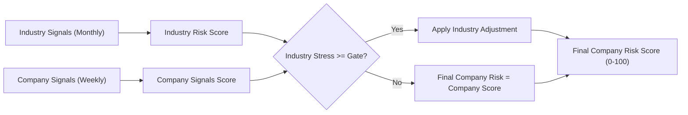
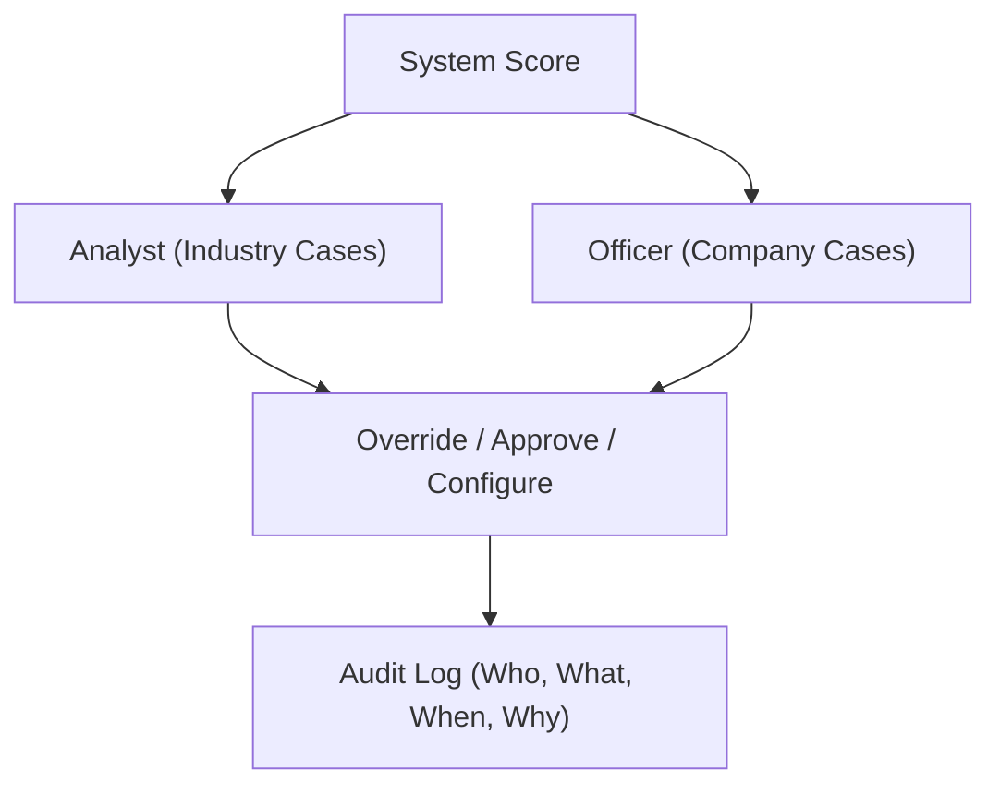
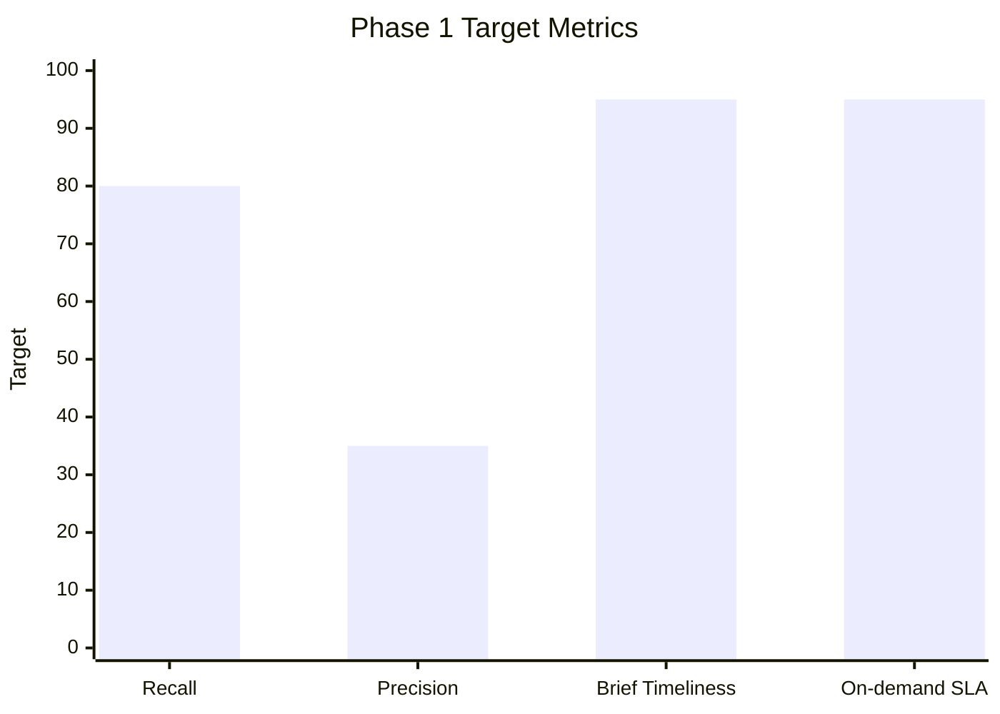

# NTUC Retrenchment Early Warning System (EWS)
## Non-Technical Report on the Proposed Solution

### 1) What this solution is
The proposed solution is an Early Warning System that helps NTUC spot companies and industries that may be at risk of retrenchment before layoffs happen.

It does this by combining:
- **Industry-level signals** (monthly trends), and
- **Company-level signals** (weekly developments),
then producing a clear **risk score (0 to 100)** for each company.

The score is designed to act like a probability estimate: higher score means higher risk.

### 2) Why this matters
Retrenchment signals often appear gradually, across multiple sources. Without one central system, these warning signs can be missed or detected too late.

This solution helps NTUC:
- detect risk earlier,
- prioritize follow-up cases,
- explain clearly why each case was flagged,
- and improve decision quality over time.

### 3) Key design principles
The system follows five principles:

1. **Early warning over perfect accuracy**  
   It is intentionally tuned to catch more possible risks, even if this creates more false alarms.

2. **Human oversight is central**  
   Analysts and officers can override scores, and every override is recorded for accountability.

3. **Explainability by default**  
   Every score shows the key contributing signals and supporting evidence.

4. **Singapore-focused context**  
   Sources and logic are tailored to Singapore data realities (industry, company registry, government sources, local forums/news).

5. **Future extensibility**  
   New data sources can be added over time without redesigning the whole system.

### 4) How scoring works (simple view)
For each company, the system produces:
- **Industry Risk Score** (monthly),
- **Company Signals Score** (weekly),
- **Final Company Risk Score** (weekly).

Industry conditions only affect company scores when industry stress is high enough (a configurable “gate”).

Current starting settings (can be adjusted later):
- Industry stress gate: 60
- Industry effect weight: 0.30
- High-risk threshold: 70
- Emerging risk watchlist: weekly increase of +10 points (if still below 70)

LaTeX form of the scoring logic:

```latex
\text{Given } C_t=\text{CompanySignalsScore at time }t,\ I_t=\text{IndustryRiskScore at time }t
```

```latex
F_t =
\begin{cases}
C_t, & I_t < \tau \\
C_t + w \cdot A(I_t), & I_t \ge \tau
\end{cases}
```

```latex
\tau = 60,\quad w = 0.30,\quad F_t \in [0,100]
```

```latex
\Delta_t = F_t - F_{t-1},\quad
\text{EmergingRisk}_t =
\begin{cases}
1, & \Delta_t \ge 10 \ \text{and}\ F_t < 70\\
0, & \text{otherwise}
\end{cases}
```



### 4.1) What signals are included and where they come from
The system combines many weak signals into one risk view. Below are the key signal groups for this POC.

#### A) Industry-level signals (monthly)
These indicate broad stress affecting many companies in the same sector.

| Industry signal type | What it indicates | Example sources |
|---|---|---|
| Official economic and labour indicators | Broad macro and labour stress in a sector | SingStat; MOM; MTI-related public releases |
| Sector cost and demand pressure indicators | Cost inflation and demand pressure affecting sector margins | URA Retail Rental Index (critical for F&B/retail); public inflation and business cost datasets |
| Hiring and labour market trend shifts (sector-wide) | Sector-level hiring slowdown or contraction patterns | Job posting aggregates/public job portals (where legally accessible); government labour publications |
| Industry stress clustering signals | Multiple companies in one sector showing concurrent stress | Internal aggregation of company-level stress patterns |

#### B) Company-level signals (weekly)
These indicate deterioration or sudden shocks at specific companies.

| Company signal type | What it indicates | Example sources |
|---|---|---|
| Retrenchment/event mentions and negative business events | Immediate adverse events or retrenchment-related signals | Public news outlets and press releases; government notices/public records where available |
| Company sentiment and reputation deterioration | Declining public sentiment and complaints | Reddit Singapore communities; HardwareZone forums; public review platforms/maps (where legal and available) |
| Hiring contraction / operational slowdown indicators | Reduced hiring demand and possible business slowdown | Changes in company job posting activity; publicly visible hiring signals and related announcements |
| Registry/compliance and corporate activity signals | Structural/legal signals tied to company health | ACRA-related public filings/registry information; eGazette and similar official publication channels |
| Rapid risk change ("emerging risk") signals | Fast week-on-week deterioration even below high-risk threshold | Internal score movement over recent weeks (delta-based detection) |

#### C) Signal quality controls applied to both levels
- **Source reliability weighting** (government sources default higher reliability)
- **Time decay weighting** (newer signals carry more weight by default)
- **Trend + event detection** (both gradual deterioration and sudden shocks)
- **Evidence linking** (every displayed signal has a source pointer)

### 5) What users will receive
Each morning, users get a **Daily Brief** with:
1. High-risk companies
2. Industries under stress
3. Major events detected
4. Emerging risk watchlist (fast-rising cases)

Users can also run **on-demand analysis** for a selected company and receive a full breakdown with evidence.

### 6) Governance and accountability
The system includes role-based controls:
- **Analysts** handle industry-level overrides/settings/approvals.
- **Officers** handle company-level overrides/settings/approvals and entity mapping approvals.

All critical actions are logged:
- score overrides,
- settings changes,
- model recommendation approvals,
- entity mapping decisions.

This ensures transparency and auditability.



### 7) Data and privacy approach
Data collection will use:
- public APIs first,
- web scraping only when APIs are unavailable,
- and NTUC-provided data where needed.

For testing and backtesting, news sources can be ingested historically (backdated).

Evidence handling defaults:
- raw source content retained for audit/reprocessing,
- personal identifiers masked in user-facing outputs by default,
- restricted access to sensitive/raw records.

### 8) POC scope and technology approach
This phase is a **local Proof of Concept (POC)**, not a production deployment.

Scope:
- Industries: **F&B** and **Tech**
- Backtesting sample: about **18 companies**

Execution approach:
- run everything locally,
- use a local database and local services,
- focus on proving value and workflow before scaling.

### 9) How success will be measured
Approved phase-1 targets include:
- Recall: at least 0.80 (detect most true risk cases)
- Precision: at least 0.35 (acceptable for early-warning mode)
- Timely detection before known events
- Complete explanation and evidence for flagged cases
- Daily brief generated by 6:00 AM SGT (on most test days)
- On-demand analysis completed within 1 hour (on most runs)



### 10) Expected outcomes for stakeholders
If the POC succeeds, NTUC will have:
- a consistent way to detect and rank retrenchment risk,
- a practical daily operating workflow for analysts/officers,
- clear evidence trails for each alert,
- and a strong base for broader rollout across more industries and companies.

---

## Executive Summary
The proposed EWS gives NTUC a practical, explainable, and auditable way to detect retrenchment risk early. It combines industry and company signals, supports daily action through briefings and watchlists, and keeps humans in control through overrides and approvals. The POC is intentionally local and focused, so NTUC can validate real-world usefulness quickly before wider deployment.
